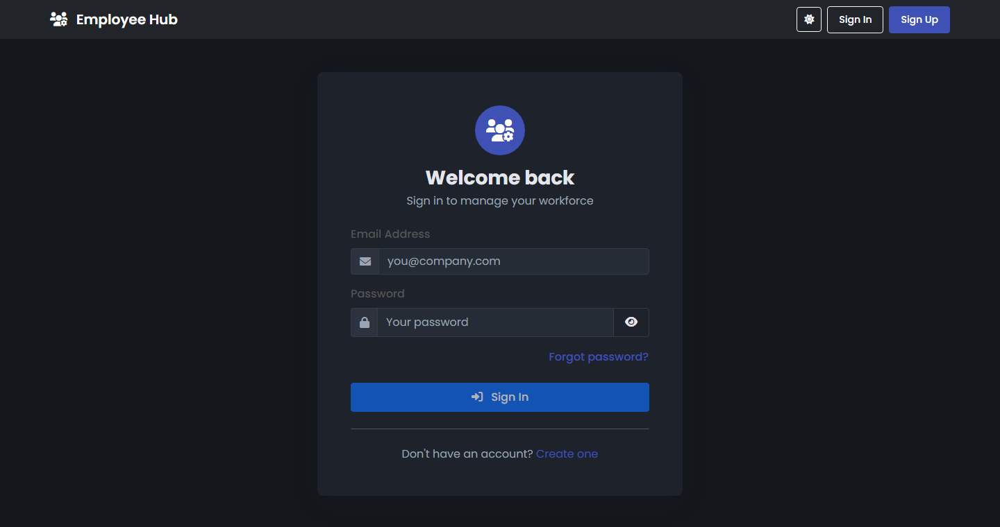
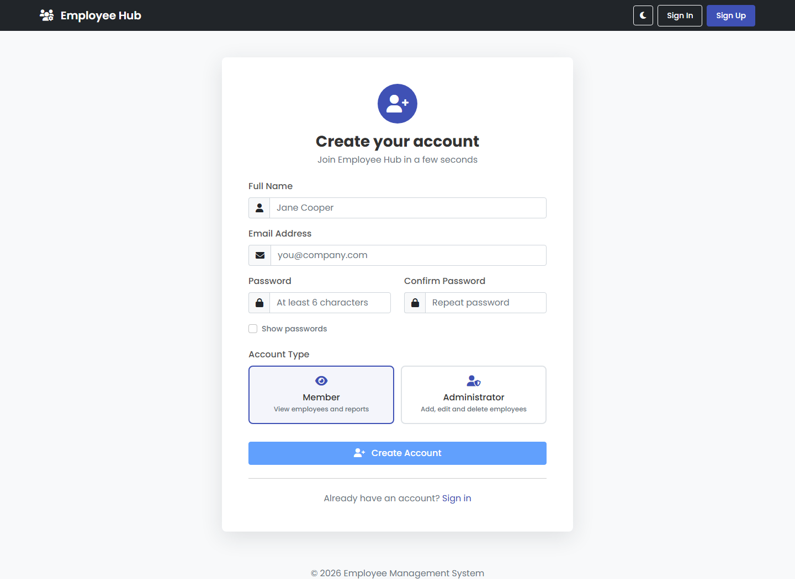
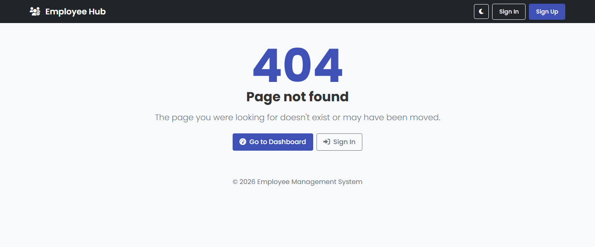

# Employee Management System

[](https://employeemanagement-0.web.app)
[](https://employee-management-jelx.onrender.com/)

**A modern, interactive employee management dashboard built with Angular 14, .NET 6, and Firebase**

## 📌 Overview  
The **Employee Management System** is a comprehensive full-stack web application designed to streamline workforce management. It utilizes a **Hybrid Architecture**:
- **Frontend**: Built with **Angular 14**, it connects directly to **Firebase Firestore** for high-speed, real-time data access, eliminating server cold-start delays.
- **Backend API**: A robust **.NET 6 Web API** that also integrates with Firestore, providing a RESTful interface for external integrations and server-side logic.

The system features a modern dashboard with data visualization, filterable employee lists, and a clean, user-friendly design.

---

## 📸 Screenshots

### Sign In — dark mode
The whole app ships with a dark theme that follows your system preference and remembers your choice.



### Sign Up — light mode
New accounts pick their access level at registration: **Member** for read-only access, or **Administrator** for full control over employee records.



### Friendly 404
Any unknown route lands on a proper not-found page instead of an empty screen.



---

## 🚀 Features  
✅ **Email/password authentication** with signup, login, and password reset (Firebase Auth)  
✅ **Role-based access**: administrators manage records, members get read-only access  
✅ Protected routes via Angular route guards, plus a friendly 404 page  
✅ Interactive dashboard with employee statistics and data visualization  
✅ Advanced filtering, sorting, and pagination of employee records  
✅ Add, edit, delete, and view employee details with a modern UI  
✅ **Live updates**: the dashboard reacts to Firestore changes without a refresh  
✅ **CSV export** and a print-friendly report view  
✅ **Dark mode** with a remembered preference  
✅ Toast notifications for every success and failure  
✅ Account page for updating display name, avatar, and password  
✅ **Hybrid Data Layer**: Direct Firebase SDK access + .NET REST API  
✅ Responsive design that works on desktop and mobile devices  
✅ Form validation with visual feedback  

---

## 🔐 Authentication & Roles

Authentication runs entirely through **Firebase Auth** (email/password). Each account also gets a
profile document at `users/{uid}` in Firestore holding its `displayName`, `photoURL`, and `role`.

| Role | Permissions |
|------|-------------|
| `admin` | View, add, edit, and delete employees |
| `user` (Member) | View employees, dashboard, exports, and reports only |

The role is chosen on the signup screen so both access levels are easy to try. **This is convenient
for a demo but not secure on its own** — a determined user could write their own role. To harden it,
move role assignment to a Cloud Function using
[custom claims](https://firebase.google.com/docs/auth/admin/custom-claims) and make the `role` field
read-only to clients in your Firestore rules.

### Routes

| Route | Access |
|-------|--------|
| `/login`, `/signup` | Public |
| `/employees` | Signed in |
| `/employees/:id` | Signed in |
| `/profile` | Signed in |
| `/employees/add` | Admin only |
| `/employees/edit/:id` | Admin only |

---

## 🛠️ Tech Stack  
### **Frontend (Angular 14)**  
- TypeScript & Angular CLI  
- Bootstrap 5  
- Firebase SDK for real-time data  

### **Backend API (.NET 6)**  
- ASP.NET Core Web API  
- Google Cloud Firestore .NET SDK  
- Dependency Injection  
- Swagger UI for API testing  

### **Infrastructure**  
- **Database**: Firebase Firestore (NoSQL)  
- **Hosting**: Firebase Hosting  
- **CI/CD**: GitHub Actions  

---

## 📁 Project Structure
The project is organized into two main components:

- `/frontend` - Angular application with Firebase integration
- `/backend` - .NET 6 Web API for RESTful access
- `.github/workflows` - Automated CI/CD pipeline

---

## 🎯 Installation & Setup  

### **1️⃣ Clone the repository**  
```sh
git clone https://github.com/your-username/Angular-14-CRUD-with-.NET-6-Web-API.git
cd Angular-14-CRUD-with-.NET-6-Web-API
```

### **2️⃣ Setting up the Backend API (.NET)**
```sh
cd backend/Fullstack.API
dotnet restore
dotnet run
```
The API will be available at `https://localhost:7047` (or similar), with Swagger documentation at `/swagger`.

### **3️⃣ Setting up the Frontend (Angular)**
```sh
cd frontend
npm install
ng serve
```
Navigate to `http://localhost:4200/` to view the application.

---

## 🚀 Deployment

### **Frontend & Database (Firebase)**
1. **Build & Deploy:** Automated via GitHub Actions on every push to `main`.
2. **Primary Live URL:** [https://employeemanagement-0.web.app](https://employeemanagement-0.web.app)
3. **Secondary Mirror (Render):** [https://employee-management-jelx.onrender.com/](https://employee-management-jelx.onrender.com/)

### **Backend API (.NET)**
The .NET backend can be containerized using the included `Dockerfile` and deployed to services like **Google Cloud Run** or **Render**.

### **Database Setup (Firebase Firestore)**

1. **Create Project:** Create a new project in the [Firebase Console](https://console.firebase.google.com/).
2. **Firestore Database:** Enable Firestore in "Production Mode" or "Test Mode".
3. **Authentication:** Under **Build → Authentication → Sign-in method**, enable the
   **Email/Password** provider. Signup and login will fail with
   `auth/operation-not-allowed` until this is on.
4. **Security Rules:** These rules match the app's role model — everyone signed in can read
   employees, only admins can write, and each user can only touch their own profile document:
   ```javascript
   rules_version = '2';
   service cloud.firestore {
     match /databases/{database}/documents {
       function isSignedIn() {
         return request.auth != null;
       }

       function isAdmin() {
         return isSignedIn() &&
           get(/databases/$(database)/documents/users/$(request.auth.uid)).data.role == 'admin';
       }

       match /users/{userId} {
         allow read, create, update: if isSignedIn() && request.auth.uid == userId;
       }

       match /employees/{employeeId} {
         allow read: if isSignedIn();
         allow write: if isAdmin();
       }
     }
   }
   ```
5. **Environment Variables:** Add your Firebase configuration to `frontend/src/app/firebase.config.ts`.

---

## 👨‍💻 Contributors
Your contributions are welcome!
